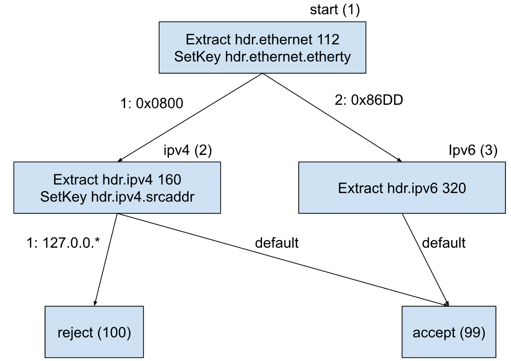
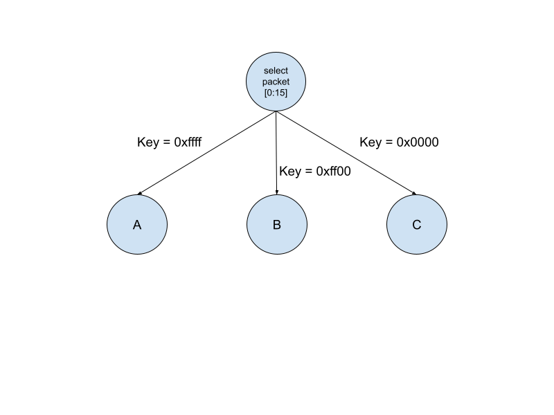
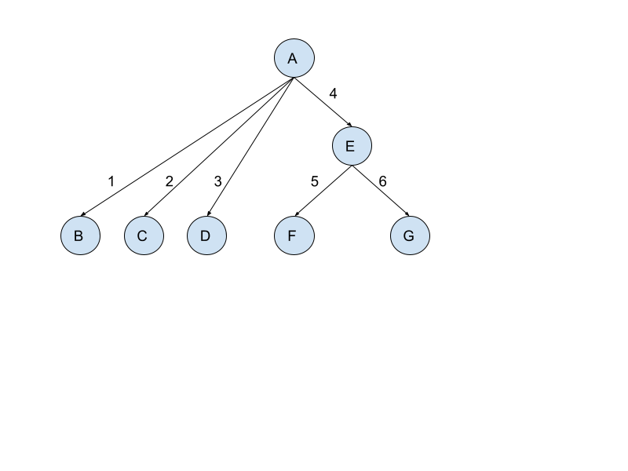
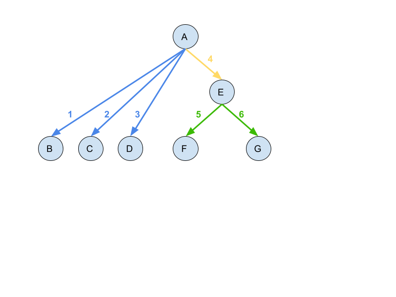
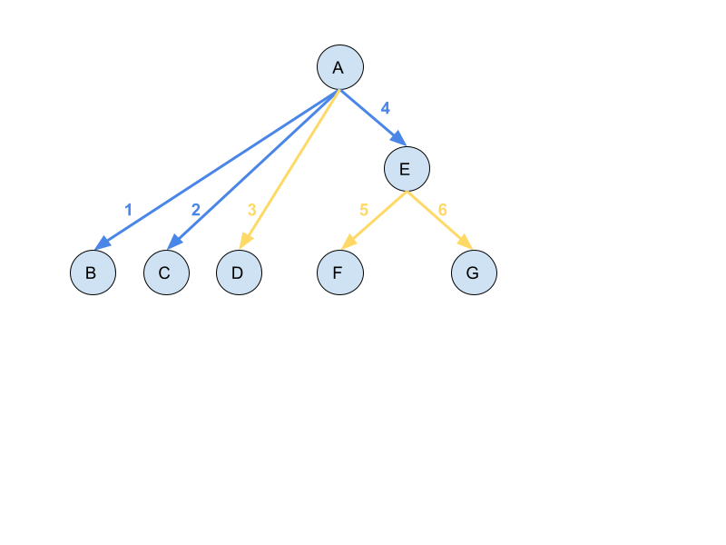

# TCAM Parser Model: Compiler

## Objective

This document contains the compilation strategy for the Cairn parser model
described in `specification.md`. It has been split into its own document due to
its great length.

The goal of our compiler is to translate P4 parsers into the Cairn IR. We choose
to target P4 parsers because P4 is the de-facto standard language for networking
devices and their parsers. Our goal is to integrate our compiler as a backend to
the open-source P4 compiler, p4c. Doing so allows us to quickly generate impact
by making our IR and tools directly available to the wider P4 community, as well
as allowing us to re-use their frontend infrastructure.

Our compiler takes as input a P4 parser and a configuration file, and outputs an
IR program which implements the behavior of the P4 parser while conforming to
the provided configuration. For example, the output IR program will never match
more keys per stage than the configuration file supports, no stage will have
more rules than the configuration allows, etc.

The remainder of this document will describe the compilation process. The
implementation of the compiler is still in-progress. We begin by defining the
subset of P4 parser syntax that we support, and describing our high-level
approach. We then describe our compilation process in detail, as a series of
program transformations that incrementally remove P4 constructs and replace them
with Cairn IR constructs.

## Constraints

The current version of this file supports the following constraints in the
configuration file:

1.  Maximum number of stages
2.  Maximum number of rules per stage
3.  Data store descriptions
4.  Key locations
5.  The ID numbers of the `accept` and `reject` states.

In order to keep things minimal, other constraints (such the number of actions
per stage) are not considered; extensions to handle these are discussed at the
end of the document.

## Compiling P4

### P4 Parser Syntax

In order to rigorously define the compilation algorithm, we formally specify the
subset of P4 parser syntax that we handle. This subset is chosen to include the
most fundamental operations (extraction, lookahead, and state transitions), so
we can focus only on the core parts of the language.

The definitions in this part are very standard, and are only included for
completeness.

1.  A P4 parser consists of a list of **parser arguments**, a list of **global
    variable declarations**, and a list of **state definitions**.
2.  A parser argument is a list of identifiers, each of which has a type and a
    read/write annotation (either `in`, `out`, or `inout`). Exactly one argument
    (“the packet”) has type `packet_in`.
3.  A global variable declaration is an identifier together with a type.
4.  A state definition consists of a **name**, a list of **action statements**,
    and a single **transition statement**.
5.  A name is simply an identifier.
6.  A transition statement may either be an unconditional transition or a select
    statement.
7.  An unconditional transition simply specifies the name of a state.
8.  A select statement contains a list of one or more **keys**, followed by a
    list of **rules**.
    1.  A key is a variable, either an extracted header, a local variable, or a
        global variable.
    2.  A rule is a pair of a list of **patterns** and the name of a state.
    3.  A pattern is a pair of two same-width integers; the first is the
        **value** and the latter is the **mask**.
9.  An action statement may be any of the following:
    1.  `packet.extract(<target>)`, in which `packet` is the packet, and
        <target> must be a fixed-width header-type, write-enabled parser
        argument (or subfield of such an argument), or a local variable.
    2.  `packet.extract(<target>, <size>)`, in which `packet` is the packet,
        <target> has the same restrictions except with exactly one `varbit`
        field, and <size> is an int-typed local variable or read-enabled parser
        argument (or a subfield of one)
    3.  A local variable definition `<ty> <name> = <exp>`, in which <ty> is the
        type of the variable <name>, and its value is the expression <exp>.
    4.  An assignment `<name> = <exp>`, where <name> is either a global variable
        or write-enabled parser argument (local variables are immutable).
10. An expression may be any of the following:
    1.  A constant integer
    2.  A variable name
    3.  `packet.lookahead(<ty>)`, in which `packet` is the packet and <ty> is a
        fixed-width type
    4.  A cast of an expression to a different type
    5.  A binary arithmetic operation between two expressions; supported
        operators are +, -, << and >>

#### Well-formedness

We make the following assumptions about the P4 programs that we process:

1.  All patterns have the same “shape” as the keys they correspond to.
2.  All extract calls target (sub)fields of the same parser argument.

Note that per the P4 semantics, if the program does not specify a transition
statement, `transition reject;` is implied. Thus we may safely assume, as we do
above, that every state ends in a transition. Similarly, we may assume that
every `select` statement contains a default branch.

#### Graph Representation

We can think of P4 parsers in two different ways. The first is the form above:
an abstract syntax tree described by the code. The other is as a DAG, in which
nodes represent states, and edges represent transitions. These graphs have the
following annotations:

1.  Each node is annotated with the statements that appear at that node, except
    the transition statement. If the transition statement involved a `select`,
    it is replaced with a `SetKey` statement containing the `select` arguments;
    otherwise, it is omitted entirely.
2.  Each edge is annotated with an integer priority value and a list of
    patterns. These values represent the branches of the transition statement at
    the source node. If that statement involved a `select`, then the edges are
    annotated with the pattern associated with that transition; otherwise, they
    are given a `default` annotation.

The graph also contains two special `accept` and `reject` states (these are
included implicitly in the P4 code as well, although they are never explicitly
specified), which have no outgoing edges or associated actions.

An example of this DAG representation appears in the main specification document
and is reproduced below. Since the two representations (list of state
definitions and DAG) contain the same information, we will use them
interchangeably.

### High-Level Strategy

Before we describe the compilation process in detail, we give a high-level idea
of how we intend to associate parse graphs with TCAM rules. In P4’s semantics,
each state either transitions unconditionally or uses a `select` statement to
match on some keys after performing all its actions, then transitions to the
next state which repeats the process. In other words, the act of matching and
transitioning is “contained” within the source state.

However, this model doesn’t work in a TCAM-based parser. In order to select the
next state, we need to compare our key value to the provided patterns. However,
there is no action that does this; furthermore, even if such an action existed,
all actions in a state are executed simultaneously. Thus, *even if* we had a way
of comparing key values as an action, we would still need at least two stages:
one to check the key values, and another to actually execute the transition.

The solution is to use TCAM’s pattern-matching capabilities to implement
`select` statements. However, we cannot do a TCAM match while executing the
actions within a rule. This means that we must split up the matching process so
that

1.  As part of its actions, each state sets the TCAM keys to the values it
    intends to match against.
2.  In the next stage of the TCAM, we set the patterns to the ones in that
    state’s `select`.
3.  Each pattern is associated with some set of actions that perform the
    transition.

This basic structure must be used in order to implement the parser using TCAMs.
The key distinction is the definition of exactly what it means to “perform the
transition”. Prior work defined this to mean “set the state value to the value
of the destination”. However, doing so tended to result in the creation of
excess intermediate states; see the discussion below for details.

#### High-level Example

Consider the parse graph below, corresponding to the simple P4 parser example in
the main specification document. As described above, nodes in this graph
correspond to states in the P4 program, while edges correspond to `transition`
statements; when the transition involves a `select`, edges are annotated with a
priority and a pattern corresponding to each branch of the `select`. Notice that
in order to accommodate the structure of the parse graph, each state’s actions
include setting the key to be matched on by each of its edges.



We translate this parse graph into a TCAM by transforming each *edge* into a
TCAM rule. Using the above terminology, we define the process of “transitioning
to state X” to mean “set the state value to X, and execute the actions of state
X”.

We translate edges into rules as follows: the rule’s pattern consists of the
edge’s annotation and the ID of that edge’s source node. The actions of the
state are those of the destination node. For example, the top-left edge above
would be associated with the rule

“state”   | “r1”   | Actions
--------- | ------ | --------------------------------
1 (start) | 0x0800 | SetState 2
          |        | CopyData packet[96:127] r1[0:31]
          |        | Extract hdr.ipv4 160
          |        | SetKey hdr.ipv4.srcaddr

In English, this rule could be read as “If we were previously at state 1 (the
start state), and our current key value is 0x0800, then we transition to state 2
(`ipv4`). This transition involves (a) setting the state value to `ipv4`’s ID
value, and (b) performing the actions of state `ipv4`; that is, extract the
`ipv4` header, and set the key to `hdr.ipv4.srcaddr`.”

In practice, our compiler will need to not only translate edges into rules, but
also translate P4-style actions into IR actions, involving locations and data
stores. Doing so involves allocating memory to store the keys that will be
matched on (including the state ID). Fully translated, the above rule would
instead be

“state”   | “r1”   | Actions
--------- | ------ | --------------------------------------
1 (start) | 0x0800 | ExtractHeader “hdr.ipv4” packet[0:159]
          |        | CopyData packet[96:127] r1[0:31]
          |        | CopyData 2 state[0:31]
          |        | Move 160

Where “state” and “r1” are the names of data stores which are matched against
the TCAM patterns at each stage.

When we compile multiple edges from the same node, we must ensure that the order
they appear in the final TCAM is consistent with their priority order. We also
always include one “default” rule at the beginning, which executes the actions
of the start state. All together, we would compile the above parse graph into
the following sequence of TCAM tables. For a more thorough description, see the
specification document.

The first table has exactly one rule, which unconditionally transitions to the
start state (sets the state value to 1 and executes its actions)

“state” | “r1” | Actions
------- | ---- | ------------------------------------------
_       | _    | ExtractHeader “hdr.ethernet” packet[0:111]
        |      | CopyData packet[96:111] r1[0:15]
        |      | CopyData 1 state[0:31]
        |      | Move 112

The next table has two rules, depending on the key that was set in the previous
stage.

“state”   | “r1”   | Actions
--------- | ------ | --------------------------------------
1 (start) | 0x0800 | ExtractHeader “hdr.ipv4” packet[0:159]
          |        | CopyData packet[96:127] r1[0:31]
          |        | CopyData 2 state[0:31]
          |        | Move 160
1 (start) | 0x86DD | ExtractHeader “hdr.ipv6” packet[0:319]
          |        | CopyData 3 state[0:31]
          |        | Move 320

The final table has three rules, and either accepts or rejects as appropriate.
Unlike the previous tables, the state value matters here, since it determines if
the r1 key gets checked or not.

“state”  | “r1”      | Actions
-------- | --------- | ------------------------
2 (ipv4) | 127.0.0.* | CopyData 100 state[0:31]
2 (ipv4) | _         | CopyData 99 state[0:31]
3 (ipv6) | _         | CopyData 99 state[0:31]

### Compiler Assumptions

When defining the compiler, we make the following assumptions about the P4
program. We can probably relax some or all of these in the future, but for now
they allow us to keep things simple. Each assumption contains a note about how
it might be relaxed when the time comes.

1.  Parsers have exactly one header argument (i.e. an argument which is a
    `header` type, or which recursively contains any `header` types)
    1.  This should imply that all extract operations target the header
        argument, or one of its fields.
    2.  Relaxing this may be trivial (i.e. the assumption might not actually
        help us), but we’re keeping it for now in case it is useful.
2.  Lookahead operations do not target the header argument defined above.
    1.  To relax this assumption, we will need to check if a given lookahead
        targets a header so we know if we should replace it with an
        ExtractHeader or a CopyData.
3.  Extracted headers are only referenced in the state in which they are
    extracted.
    1.  This is the big one. Since our extracted header map is write-only, we
        cannot actually read the extracted value the way the P4 program does.
        Instead, we need to proactively copy the appropriate header bits at the
        same time as we extract the header. This assumption ensures that we can
        do that.
    2.  Relaxing this assumption is possible, but will require sophisticated
        analysis to proactively extract header values in states prior to their
        eventual use.
    3.  Note that programmers are able to use global variables to store
        extracted header values between states if necessary.

### Compiler Passes

Our compiler is represented as a series of program transformations, each of
which replaces some P4 constructs with IR constructs, or modifies the P4 code to
more closely match the format of the IR. Our passes are as follows:

1.  Convert global variable uses to use local variables instead (necessary for
    correctness of the next pass)
2.  Convert `extract` and `lookahead` calls to `ExtractHeader` and `CopyData`
    actions, respectively.
3.  Inline local variables.
4.  Replace references to extracted headers with references to the appropriate
    position in the packet.
5.  Allocate memory (i.e. subsets of data stores) to store global variables and
    parser arguments
6.  Allocate memory to store key values, and split up states if we try to match
    on too many keys at once.
7.  Assign edges in the parse graph to TCAM stages
8.  Convert edges in the parse graph to TCAM rules

#### Pass 1: Global variable replacement

P4 parser statements are evaluated one-after-another, in order. This means that
if one statement changes the value of a global variable, that update is visible
for all later statements, but not earlier ones. See below for an example:

```
state foo {
  packet.extract(hdr1, x); // x is an 8-bit global. This uses the original value of x
  x = packet.lookahead(bit<8>);
  packet.extract(hdr2, x); // This uses the new value of x
  transition accept;
}
```

In contrast, IR parser statements are evaluated in parallel, meaning that all of
them see the same value for global variables. A naive solution is to inline the
new definition of `x` in the above code, so only the original value remains.
However, inlining potentially changes the order of statements; since some
statements (specifically, `extract`s) have side effects, inlining is unsound
until they are eliminated. Instead, we replace each global variable assignment
by an equivalent local variable declaration, and also replace later uses of that
global with the equivalent local. This way, we can syntactically distinguish
between the global’s original value and its updated value (the local). The local
will then be inlined by a later pass, when it is safe to do so. Finally, we will update the global variable to the value stored in newly added local variable to guarantee the correctness of its final value.
When applied to
the above example, the transformation would produce the following: 
```
state foo {
  packet.extract(hdr1, x); // x is an 8-bit global. This uses the original value of x 
  x_new = packet.lookahead(bit<8>); // This will get inlined later, so no overhead 
  packet.extract(hdr2, x_new); // This uses the new value of x 
  x = x_new; // This will update back the global variable
  transition accept; 
}
```

#### Pass 2: Extract and Lookahead Conversion

Our first pass converts all `extract` and `lookahead` calls to `ExtractHeader`
and `CopyData` actions, respectively. A key difference between P4 and TCAM
semantics is that in P4, extracting a header immediately moves the cursor; in
the TCAM, extractions are separate from moves, and the move happens
simultaneously with the other actions in the state. For example, consider the
following P4 snippet:

```
extract(hdrs.hdr1); // 64 bits long
extract(hdrs.hdr2); // 32 bits long
```

This is equivalent to the following TCAM snippet:

```
ExtractHeader `hdrs.hdr1` packet[0:63]
ExtractHeader `hdrs.hdr2` packet[64:95]
Move 96
```

The two main differences are that the second extract explicitly begins at the
end of the previous one, and the `Move` at the end is the sum of the lengths of
the extracted headers.

##### English Description

In English, our algorithm does the following, for each state in the P4 parser:

1.  Maintain a tracker of how many bits we’ve moved so far in this state.
    1.  Note that since we might move by variable amounts, the tracker should be
        an expression representing this value, rather than a known integer.
2.  Whenever we see an extract command, replace it with an ExtractHeader of the
    appropriate length, starting at the current tracker value. Then increment
    the tracker by that length.
    1.  For fixed-size extractions, the length is the size of the type of the
        extracted header, in bits.
    2.  For variable-sized extractions, the length is the sum of the sizes of
        the extracted header’s non-varbit fields, plus the value of the second
        argument.
3.  Whenever we see a lookahead, replace it with a packet location of the
    appropriate length, starting at the current tracker value. Do NOT increment
    the tracker afterwards.
    1.  The appropriate length is the size of the extracted type, in bits.
4.  When we get to the end, add a Move command containing the tracker’s current
    value.

##### Pseudocode Description

Equivalently, here is some python-ish pseudocode describing the transformation.

```
for state in parser.states:
  # The tracker must be an expression since we might move by variable amounts
  tracker = Expression(0)
  for statement in state.statements:
    match statement:
      case Extract(hdrvar): # Fixed-size extraction
        length = Expression(sizeof(hdrvar.type))
        # Replace the Extract statement with an appropriate ExtractHeader
        statement = ExtractHeader(hdrvar.name, packet[tracker:tracker+length-1])
        tracker += length
      case Extract(hdrvar, size): # Variable-size extraction
        length = Expression(sizeof(hdrvar.type)) + size
        statement = ExtractHeader(hdrvar.name, packet[tracker:tracker+length-1])
        tracker += length
      case default:
        # Some other statement. Recursively examine its expressions for lookaheads
        for expression in state.expressions:
          match expression:
           case Lookahead(ty):
             length = Expression(sizeof(ty))
             expression = packet[tracker:tracker+length-1]
             # Do NOT increment tracker -- only extract does that
  # End for
  state.statements.append(Move(tracker))
```

##### Translation Example

An an example, the P4 program below:

```
state foo {
  packet.extract(hdrs.ethernet); // 112 bits long
  x = packet.lookahead(bit<8>);  // 8 bits long
  packet.extract(hdrs.ipv4, x);  // 160+x bits long
  transition accept;
}
```

Gets transformed into

```
state foo {
  ExtractHeader "hdrs.ethernet" packet[0:111]
  x = packet[112:119]
  ExtactHeader "hdrs.ipv4" packet[112:271+x]
  Move 272+x
  transition accept;
}
```

#### Pass 3: Local Variable inlining

This is a very standard program transformation. We replace each local variable
usage in the body of each state with its definition, and delete its original
assignment. Note that thanks to pass 1, there will be no need to inline global
variables, since they will never be assigned to and then later used.

##### Translation Example

This pass is simple enough that it should suffice to simply give an example:

```
state foo {
  int<8> y = packet[0:7]
  // x is a global variable defined outside this state
  ExtractHeader "hdr1" packet[x:y]

  int<8> z = packet[y:x+16]
  ExtactHeader "hdrs.ipv4" packet[0:z]
  transition accept;
}
```

Gets transformed into

```
state foo {
  // x is a global variable defined outside this state
  ExtractHeader "hdr1" packet[x:packet[0:7]] // y is inlined, x isn't

  // y is inlined into z, which is then itself inlined.
  ExtactHeader "hdrs.ipv4" packet[0:packet[packet[0:7]:x+16]]
  transition accept;
}
```

#### Pass 4: Replacing header references

This pass finds all places where a previously-extracted header is referenced,
and replaces that reference with a direct reference to the appropriate location
in the packet. Note that one of our assumptions is that every header reference
is preceded by an extraction in the same state, so we can always determine the
header’s packet position directly. Our strategy is as follows:

1.  Examine each expression in each state.
2.  If that expression is a `header`-type variable, look earlier in the state to
    find where it was extracted.
3.  Examine the type of the extracted header to determine which bits from that
    header corresponding to the variable.
4.  Replace the variable with a location corresponding to those bits, expressed
    as a location within the packet. For example, if we have the following P4
    snippet:

```
header ethernet_t {
    bit<48> dstAddr;
    bit<48> srcAddr;
    bit<16> etherType;
}

...

struct headers {
    ethernet_t ethernet;
}

...

parser(packet_in packet, out headers hdr) {
  state foo {
    extract(hdr.ethernet);
    transition select(hdr.ethernet.etherType) {
      TYPE_SRCROUTING: parse_srcRouting;
      default: accept;
    }
  }
}
```

Our previous passes would transform the state to the following:

```
state foo {
  ExtractHeader "hdr.ethernet" packet[0:111]
  Move 112
  transition select(hdr.ethernet.etherType) {
    TYPE_SRCROUTING: parse_srcRouting;
    default: accept;
  }
}
```

To apply this pass, we would notice the reference to the variable
`hdr.ethernet.etherType`. We look backwards to see that we extracted
`hdr.ethernet` from `packet[0:111]`. We can then examine the type of
`hdr.ethernet` to determine that the `etherType` field takes up the last 16
bits, so we can replace the variable usage with the last 16 bits of
`packet[0:111]`, i.e. `packet[96:111]`. Overall, we end up with the following:

```
state foo {
  ExtractHeader "hdr.ethernet" packet[0:111]
  Move 112
  transition select(packet[96:111]) {
    TYPE_SRCROUTING: parse_srcRouting;
    default: accept;
  }
}
```

#### Pass 5: Global Memory Allocation

This pass replaces all references to global variables and parser arguments with
appropriate locations within data stores. Doing so requires us to figure out
where each global/argument is located, i.e. to allocate memory within data
stores.

Recall that each data store has the following attributes, all booleans:

1.  read/write: true if the store can be read/written, respectively
2.  persistent: if true, the store’s value is visible after parsing completes.
3.  masked-writes: if true, then writes to a subset of the store preserve the
    remaining bits; otherwise, unwritten bits are set to 0.

We need to allocate two kinds of variables globally: arguments to the parser,
and global variables. We do not allocate the packet argument or the header-type
argument. Different types of variable have different restrictions:

1.  `out` and `inout` parser arguments must be allocated in a persistent store
    which allows writing (and reading, in the case of `inout`). If the argument
    has subfields that are written separately, then those subfields must either
    be stored in different data stores, or packed together in stores that allow
    masked writes.
2.  Global variables must go in read/write stores, and need not go in persistent
    stores.
3.  `in` parser arguments can be allocated to any read-enabled store.

##### Allocation Strategy

To allocate memory, we go through each variable in the above order (`out` and
`inout` arguments, then globals, then `in` arguments). For each, we arbitrarily
select subsets of data stores to contain that variable. When doing so, we
respect the following rules:

1.  Never allocate space in a location that the configuration file designated as
    storing a key
2.  Match the attribute requirements described above; if an attribute is not
    required, prefer stores without that attribute (e.g. prefer to put an `out`
    argument in a write-only store, but read/write is acceptable).
3.  Prefer to allocate the entirety of non-masked-writable stores to single
    values, since they cannot be safely used to store multiple values (writing
    one value will zero out the others). Prefer NOT to partially allocate
    non-masked-writable stores, since that leaves unused space.

Once we are done, we will have a mapping from global variables and parser
arguments to locations within data stores. The final step is to replace
references to those variables in the program with references to the appropriate
locations. This follows the exact same process as the previous pass (replacing
references to header variables), except we reference our allocation map instead
of finding the place where the relevant header was extracted. We can also
replace assignment statements with `CopyData` actions, since we will now have
translated all P4 variable references into IR locations.

##### Translation Example

```
parser(packet_in packet, out headers hdr, inout int<8> x) {
  int<32> some_global;

  state foo {
    some_global = 40 << x;
    transition select(x) { ... }
}
```

To translate this, we would first search for appropriate locations in our data
stores to store `some_global` and `x`. Let’s say that we allocate `reg1[32:63]`
to `some_global` and `reg2[16:23]` to `x`; we can then translate the above state
to.

```
state foo {
    CopyData (40 << reg2[16:23]) reg1[32:63]
    transition select(reg2[16:23]) { ... }
  }
```

#### Pass 6: Key Allocation

##### Match splitting

The final P4 construct we need to eliminate is the `select` statement, which
matches on one or more keys. The primary difficulty here is that P4 allows
select statements to match on arbitrarily many arguments, but the hardware only
supports a certain number of keys of predefined lengths (as designated in the
config file). As a result, we may need to split up matches that contain multiple
keys, by first matching on some of the keys and then later matching on the rest.

For example, if we could only match on 8 bits at a time, we would transform the
below parse graph



into


##### State Bits

When we finally transform edges in the parse graph into TCAM rules, one of the
keys we will match on will be the state ID of the source node. This means we
need to allocate some portion of the key memory to storing that ID.
Unfortunately, we do not know *a priori* how much space we will need, because
the compilation process may create new states. Worse, the amount of new states
we create depends on the amount of key memory we have available, and the more
space we allocate to the state ID the less we have for keys.

In other words, it is very difficult to predict exactly how many state bits we
will need. To avoid this problem, we take a conservative estimate: using the
configuration file, we determine the maximum number of rules in the TCAM (the
number of stages times the rules per stage). We cannot possibly have more states
than we have rules in the TCAM, so we use this number as an upper bound on the
number of states. This allows us to determine how many state bits we need. We
then allocate memory to store those bits using the same rules as allocating
global memory, except that we store the bits in key memory.

##### Allocation Algorithm – The Simple Case

With the above in mind, our strategy for allocating keys is as follows. We apply
this process to each state in the parse graph, walking over the states in
topological order (so that if we create new child states, we will recursively
apply the process to them as well). We only describe the simple case (no state
splitting) here; the full version appears later.

1.  Load this state’s ID number into the state bits using a `CopyData` action
2.  If the `transition` statement is unconditional, finish.
3.  Otherwise, examine the `transition select` statement to determine which keys
    we are matching on in this state.
4.  Allocate as many keys as possible into the designated key locations, and
    load them into their assigned locations using `CopyData` actions.
5.  If we managed to allocate all the keys, adjust the select statement to match
    on the designated key locations, in order. Then adjust the patterns for each
    allocated key to match the size of those locations.
6.  Otherwise, move on to the less simple case (The next section).

###### Interlude: Example of the Simple Case

It is instructive to demonstrate the simple case before moving on to the
complicated case. Consider the following state, and imagine that we have three
designated key locations: `reg1[0:15]`, `reg2[0:31]`, and `reg3[0:31]`, in that
order, where `reg3` allows masked writes.. Assume we have allocated all 16 bits
of the first location to storing the state ID, which for state `foo` is
`0x0007`.

```
state foo {
  transition select(metadata[0:15], reg4[0:15], reg5[8:23]) {
    0x0800, 0x9999, 0xffff: state_a
    0x86DD, 0x0000, 0x0001: state_b
}
```

We would translate this as follows:

```
state foo {
  CopyData 0x0007 reg1[0:15]
  CopyData metadata[0:15] reg2[0:15]
  CopyData reg4[0:15] reg3[0:15]
  CopyData reg5[8:23] reg3[16:31]

  // In every state,we change the select to match on these three locations exactly
  transition select (reg1[0:15], reg2[0:31], reg3[0:31]) {
    0x0007, 0x0800****, 0x9999ffff: state_a
    0x0007, 0x86DD****, 0x00000001: state_b
}
```

Here, we have allocated the first key (`metadata[0:15]`) key to `reg2`, and both
the second and third keys to different halves of `reg3`. We have also changed
the select statement to match on all of the key locations, in the appropriate
order. Notice how we have adjusted the patterns to accommodate the size of the
key locations; we added wildcard bits to ignore the unwritten bits in `reg2`,
and concatenated the patterns for the other two keys to account for `reg3`’s
larger size.

##### Match Splitting Strategy

We now consider the case from the above algorithm where we weren’t able to
allocate all the keys – for example, because we were trying to match on 32 bits,
but the hardware only provided 16 bits (after accounting for state bits). In
this case, we must split up the match statement. The first step is to remove the
keys and patterns for unallocated keys; for example, consider the example below.

```
transition select (x, y, z, w) {
    1, 2, *, 4: state_a
    *, 6, 7, 8: state_b
}
```

If we only manage to allocate, say, x and z, we would start by turning this into

```
// NOTE: This is only partially transformed!
transition select (x, z) {
    1, *: ???
    *, 7: ???
}
```

It is tempting to then create two secondary matches on y and z, one for each
branch of the original. This is demonstrated below; sadly, it is incorrect, but
it is instructive to consider.

```
// A tempting but INCORRECT transformation of the original 4-way select.

state start {
  transition select (x, z) {
    1, *: new_state_1
    *, 7: new_state_2
  }
}

state new_state_1 {
  // If we're here, we matched the first branch in the original state, so we only
  // have to check to see if we match the rest of that branch or not.
  // (Reminder: That argument is not actually correct)
  transition select(y, w) {
    2, 4: state_a
  }
}

state new_state_2 {
  transition select(y, w) {
    6, 8: state_b
  }
}
```

Sadly, this transformation fails if we consider the original key values (1, 6,
7, 8). This key matches only the second branch of the original match. However,
when we match just the `x` and `z` values (1, 7) in the first `select`
statement, we end up matching the pattern `1, *` and transitioning to
`new_state_1`, which can only go to `state_a`. The issue is that removing `y`
and `w` removed information telling us which branches we *didn’t* match, so we
can’t just assume that we match the first branch we see in the `start` state.

The solution here is to transform our `start` match into a *multi-match*. Unlike
a normal TCAM match, which tells us the first branch our pattern matches, a
multi-match tells us *all* branches that it matches. Fortunately,
[prior work](http://oasis.cs.berkeley.edu/publications/yk04.pdf) has provided an
algorithm for implementing multi-match on normal TCAM hardware. We discuss the
process in more detail later in this document.

Applying this process to the original example would give us the following
correct transformation:

```
state start {
  transition select (x, z) {
    1, 7: new_state_1 // Might match branch 1 or branch 2
    1, *: new_state_2 // Can only match branch 1
    *, 7: new_state_3 // Can only match branch 2
  }
}

state new_state_1 {
  transition select(y, w) {
    2, 4: state_a
    6, 8: state_b
  }
}

state new_state_2 {
  transition select(y, w) {
    2, 4: state_a
    // No way to get to state_b from here
  }
}

state new_state_3 {
  transition select(y, w) {
    // No way to get to state_a from here
    6, 8: state_b
  }
}
```

##### Allocation Algorithm – Complete Version

We are now in a position to finish the algorithm we started earlier. For
convenience, we reproduce the steps from above. Walking over states in
topological order, apply the following process to each state:

1.  Load this state’s ID number into the state bits using a `CopyData` action
2.  If the `transition` statement is unconditional, finish.
3.  Otherwise, examine the `transition select` statement to determine which keys
    we are matching on in this state.
4.  Allocate as many keys as possible into the designated key locations, and
    load them into their assigned locations using `CopyData` actions.
5.  If we managed to allocate all the keys, adjust the select statement to match
    on the designated key locations, in order. Then adjust the patterns for each
    allocated key to match the size of those locations.
6.  Otherwise, remove the unallocated keys and their corresponding patterns from
    the select statement to create a partial match.
7.  Apply the match-splitting algorithm described below to transform the partial
    match into a multi-match, each of whose branches is associated with a set of
    branches from the original match (a matchset).
8.  For each branch of the multi-match, create a new state which that branch
    transitions to.
9.  In each new state, include the following:
    1.  The `Move` from the end of the original state, if one exists.
    2.  A new `transition select` statement that matches on the unallocated keys
        and their associated patterns. Only include branches in the matchset of
        the multi-match branch leading to this state.
        1.  E.g. In the above example, `new_state_1` includes patterns from both
            the original branches, but `new_state_2` and `_3` only include one
            pattern.
10. Remove the `Move` from the original state (so we don’t move until we’ve
    matched on everything).

Note that since we are walking across the nodes topologically, we will continue
this process recursively on each of the newly-created nodes, allowing us to
split them up as well if necessary.

##### Optimizations

This pass of the algorithm is by far the most dangerous in terms of being able
to fit the program on the hardware – creating new states increases the amount of
space we take, potentially by a lot. In practice, it is unlikely we will end up
with a full exponential explosion – the authors of the
[prior work](http://oasis.cs.berkeley.edu/publications/yk04.pdf) claim that the
number of intersections between real-world rules tends to be significantly
smaller than the theoretical maximum. However, we certainly should try to keep
the amount of splitting as low as possible, ideally avoiding any at all.

Fortunately, we have some control over the matter – the choice of keys to
allocate heavily influences how many intermediate states are required. For
example, when we allocated `x` and `z` first in our previous example, we ended
up with 3 intermediate states (one for each rule, and one for both). This is
because their patterns `(1, *)` and `(*, 7)` overlapped. However, if we had
instead started by matching on `y` and `z`, we would have gotten the patterns
`(2, 4)` and `(6, 8)`, which do not overlap at all. Hence we would have only
required two intermediate states (one for each).

A fully optimal allocation algorithm is beyond the scope of this work, but the
general principle is to try to prioritize allocating keys with constant
patterns. The best case is if we can find a key for which some “column” of the
pattern (e.g. the first hex digit) is different in each rule – then those rules
will never overlap, and we will never need extra intermediate states.
Conversely, we should try to avoid allocating keys with wildcard patterns, since
those provide ample opportunity for overlap. That said, keys with most or all
wildcard patterns are not likely to create too many additional states, since the
patterns will overlap heavily.

#### Pass 7: Stage Assignment

By this point, we finally have a parse graph that is ready to be transformed
into a TCAM. The final steps are to turn each edge into a TCAM rule, which are
assigned to stages. We first do the stage assignment, then the rule
transformation.

To assign edges to stages, we walk over the nodes in topological order. At each
node, we will assign all of its outgoing edges to stages; note that by
definition, all incoming edges will have been assigned by the time we start
processing the node.

At each node, compute its minimum viable stage as 1+the highest stage of any
incoming edge. In priority order, assign each outgoing edge of that node to that
stage, until the stage is full (it has a number of edges equal to the maximum
number of rules per stage, as defined in the config file). Once the stage fills
up, continue assigning edges to the next stage until it fills up, and so on
until all edges are assigned.

Note that the starting stage number is 0, and this algorithm will never assign
edges to a stage less than 1. This is intentional – the initial state will be
used for the initial, unconditional rule that is always executed first. This
could be thought of as an implicit edge entering the start state.

##### Optimizations

This assignment strategy is simple, but not optimal. Consider the following
graph:



Assume we have space for 3 rules per stage, and edges are listed left-to-right
in priority order. Then our algorithm will assign edges 1,2,3 to stage 1, edge 4
to stage 2, and edges 5 and 6 to stage 3.



However, if there is no possibility for overlap between edge 4 and edge 3 (i.e.
their patterns are disjoint), then we could instead allocate edges 1,2,4 to
stage 1, and edges 3,5,6 to stage 2 – saving a whole stage.



An optimal algorithm should therefore consider two things: the potential overlap
between edge patterns, and the maximum length of any path including each edge.
In this case, the maximum length of a path including edge 4 was longer than that
for edges 1,2,3, so we should prefer to allocate 4 first, assuming it does not
overlap with an earlier edge (so that we have not inverted the priority order by
allocating it early).

#### Pass 8: Rule translation

The final step of our translation is to convert edges into rules. We do so by
walking over each edge, first by assigned stage number, then by priority order
(for multiple edges with the same source within a stage).

The conversion is simple: We create a rule whose patterns are the same as the
patterns on the edge, and whose actions are the actions of the edge’s
destination state. We also create one initial rule, which is assigned to stage 0
(the only rule in that stage). Its patterns are all wildcards, and its actions
are those of the start state. This process has already been demonstrated in the
High-Level Example above.

We then combine all the rules for each stage (still respecting priority order
within each stage) to create one table per stage; the list of these tables (in
order) is our TCAM.

## Multi-Match Conversion

Part of our Key Allocation pass above requires us to convert a regular
first-match `select` statement into a multi-match statement, i.e. one which can
match multiple branches instead of just the first. This transformation is
challenging because the multi-match must nonetheless be implemented in the
hardware TCAM, which is first-match. Fortunately,
[prior work](http://oasis.cs.berkeley.edu/publications/yk04.pdf) provides us
with an algorithm for doing so. We discuss and describe their algorithm here.

### Problem Statement

The goal of this algorithm is to take a list of rules (represented by their
patterns) and return a new list of rules with the same keys, each of which is
associated with a set of rules from the original list (called a **matchset**).
When any given keys are matched against the new list of rules by a normal
first-match TCAM, the matched rule should correspond exactly to the set of
original rules whose patterns match those keys.

### Preliminary Definitions

For the remainder of this section, we will refer to rules and patterns
interchangeably (the action part of the rule is irrelevant, as we only care
about which rules get matched, not what they do). For simplicity, we assume each
rule has only one pattern; if we start with multi-pattern rules, we can simply
concatenate the patterns. We will consider each pattern to be a list of bits,
some of which are replaced with wildcards.

The [prior work](http://oasis.cs.berkeley.edu/publications/yk04.pdf)’s strategy
relies on classifying relationships between each pair of rules. The possible
relationships are:

1.  Disjoint: No value matches both R1 and R2. Mechanically, this means that
    there is some bit where R1 is 0 and R2 is 1, or vice-versa.
2.  Subset: Any value that matches R1 also matches R2. Mechanically, this means
    that every bit in R2 is either the same as the corresponding bit in R1, or
    is wild.
3.  Superset: Any value that matches R2 also matches R1. Mechanically, this
    means that every bit in R1 is either the same as the corresponding bit in
    R2, or is wild.
4.  Intersect: Some values match both R1 and R2, but neither is a subset of the
    other. Mechanically, this means that R1 and R2 agree on all non-wild bits,
    and both R1 and R2 have a wild bit corresponding to a non-wild bit in the
    other.

A note on subset/superset: They define superset to be strict and subset to be
non-strict, but I’m pretty sure that for our purposes we’ll want to include
“equal” as a separate category.

Given two rules, we also need to be able to compute their intersection. To
compute an intersection, go through the pair of rules bit-by-bit.

1.  If both rules have the same pattern (0, 1, or wild), then the intersection
    has that pattern.
2.  If one rule has a wild pattern and the other has a constant, then the
    intersection has the constant pattern
3.  If the rules have different constant patterns, then the intersection is
    empty (they are disjoint).

### Conversion Algorithm - English

The pseudocode for this algorithm appears on page 4 of the
[prior work](http://oasis.cs.berkeley.edu/publications/yk04.pdf). In English,
the algorithm works as follows:

1.  Create an empty list representing the new set of rules, each of which is
    associated with a matchset (a set of indices indicating which of the
    original rules are matched).
2.  One-by-one, insert rules from the original list into this new list.
3.  To insert a rule, compare that rule to each existing rule in the new list:
4.  If the two rules are **disjoint** then we do nothing and keep going.
5.  If the new rule is a **subset** of the existing rule, then it’s possible to
    match both rules, or just the existing rule. Add the existing rule’s
    matchset to the new rule’s matchset, and insert the new rule immediately
    before the existing rule. Then stop inserting, since we know we won’t match
    anything after the existing rule (since it’s a superset of us).
6.  If the new rule is a **superset** of the existing rule, then we add the new
    rule’s matchset to the existing rule’s matchset, and keep going. We can’t
    just insert the new rule after the existing rule, since we may also be a
    superset of later rules.
7.  Finally, if the two rules **intersect** (but neither is a subset of the
    other), we create a new rule representing that intersection, whose matchset
    is the union of both rules’ matchsets. We insert the intersection
    immediately before the existing rule, and continue inserting.
    1.  However, if the intersection is already in the list of rules, we need
        not insert it again.

### Conversion Algorithm - Pseudocode

Below we have reproduced a modified version of the pseudocode given in the
[prior work](http://oasis.cs.berkeley.edu/publications/yk04.pdf). The
modifications are for readability only; they primarily enforce consistent
naming, but also make other changes such as changing the order in which rules
are compared (so subset becomes superset and vice-versa).

```
def create_multimatch_rules(Rules):
  E = [];
  for R in Rules:
    MR = { index(R) }
    E = insert(R, MR, E);
  return E;

def insert(R, MR, E):
  for (Ri, Mi) in E:
    switch the relationship between R and Ri:
      case disjoint:
        continue;
      case strict-subset:
        MR = MR ∪ Mi;
        insert (R, MR) into E before Ri;
        return E;
      case superset: # Non-strict, may be equal
        Mi = MR ∪ Mi; # Modifies the existing Mi in E
        continue;
      case intersection:
        Rint = Ri ⋂ R;
        Mint = MR ∪ Mi;
        # I'm not sure what this second condition is checking; it seems like it will
        # always be false. I suspect it's a typo in the original pseudocode.
        if (Rint ∉ E and MR ⊄ Mi):
          insert (Rint, Mint) into E before Ri;
        continue;
  # End for
  insert (R, MR) at the end of E;
  return E;
```

### Modifying the Algorithm

#### Handling Identical Rules

If multiple rules in the original list are identical, the algorithm above might
create extra rules (by inserting the same pattern into the list multiple times).
While identical rules are unlikely to be written directly by a user, they might
occur after we delete part of the patterns.

To avoid creating these extra rules (and hence extra intermediate states), the
easiest solution is to combine identical rules before applying the algorithm –
i.e. assign them a single index, which indicates a match with all of them. We
can then ensure that each rule we process is distinct, preventing this issue.

Alternatively, in the case that we run into equal rules during insert, we might
be able to combine the subset and superset cases: add our matchset into the one
for the existing rule (like we do for superset), but then stop processing (like
we do for subset), because we know we won’t hit anything else, by the same logic
as for the subset case.

## Future Work

### Constraint: Maximum Actions per Stage

One constraint we have discussed, which the above passes do not handle, is a
limit on the maximum number of each action type per stage, as well as a limit on
the total number of actions per stage. In the future, we may add further
restrictions of this sort (e.g. no more than one write to a given data store).

We can enforce such restrictions using an additional pass, in which we examine
each state to see if it violates the restrictions. If so, we split the stage,
using a similar process to the one used during key allocation. However, this
splitting is much simpler: since we’re not branching, we can simply create a new
stage and transfer to it unconditionally. We then put as many actions as
possible into the original stage, and put the rest (including the `Move` and the
original `transition`) into the new stage. If the new stage still violates the
restrictions, we can repeat the process recursively.

As a possible optimization, we might additionally consider trying to order the
actions we perform in each stage. For example, prioritize actions that read from
locations near the cursor; once those are executed, we can move forward a little
and continue from the new cursor position. This might be more efficient than
moving the cursor all at one in the final stage, especially if we add
constraints about how far from the cursor reads are allowed to happen.

#### Translation Example

Consider the following code; assume that we have a constraint saying at most 1
ExtractHeader may occur in each state.

```
state foo {
  ExtractHeader "eth" packet[0:111]
  ExtractHeader "ip" packet[112:271]
  Move 272
  transition ...
}
```

We can enforce this constraint by splitting this stage as follows: ``` state
foo_1 { ExtractHeader "eth" packet[0:111] transition foo_2 }

state foo_2 { ExtractHeader "ip" packet[112:271] Move 272 transition ... } ```

### Constraint: Minimum Move Increment

Another constraint we have considered adding is a minimum unit for moves, most
likely 1 byte. Such a constraint would force Move commands to move only in
multiples of 8 bits (or whatever other increment the config file specifies).

One might even imagine extending this constraint to include reads and writes,
effectively enforcing aligned memory access.

The easiest way for us to handle this constraint is to simply emit an error if
the user tries to move the packet by an invalid amount (by reading a header of
an inappropriate size). We could instead pad moves automatically to the correct
increment, but this is dangerous, since if the user is unaware that we are doing
so it will likely cause them to write their code incorrectly.

### Constraint: Maximum Read/Extract Distance

Yet another constraint we have discussed is a maximum distance from the cursor
at which copies and extracts are allowed; e.g. one might not be able to read a
value more than 1024 bits from the cursor. Accommodating such a constraint would
require us to insert move commands whenever we tried to go past this limit.
Since commands are executed in parallel, this would also require splitting the
state (so we do some actions, then move, then transition to a new state to do
the rest of the actions).

### Constraint: Maximum Number of Extracted Headers

We have also discussed adding a constraint limiting the number of extracted
headers. This constraint is best enforced using static analysis on the original
source code, not during compilation, since we have no way to tell how many
headers have already been extracted in the middle of parsing. This constraint
may also make more sense if in the future we switch to a stack-based model of
extracted headers, rather than the current string-indexed map.

### Extension: Long-Distance Matches

Currently, we impose a constraint on ourP4 programs that states may only match
on header fields that have been extracted as part of that state. We do so to
ensure that we can syntactically determine which bits of the packet the header
field corresponds to, and that those bits are accessible (i.e. they appear after
the cursor). However, this restriction is onerous.

One could imagine a more sophisticated compiler which does not impose this
requirement. To handle matches on arbitrary previously-extracted header fields,
the compiler would then have to analyze the program to determine which header
fields might be matched on, and proactively extract the relevant bits in the
prior state where the header is extracted. It would then have to allocate memory
to store those bits, and copy them into the appropriate key location at
match-time.

The analysis required seems doable, but significantly challenging; one would
have to consider all paths from all extractions to all future uses, and ensure
that memory is reserved at all points along those paths. A program which
frequently does this sort of “long-distance match” would likely run out of
memory quickly, but programs which do so sparingly are likely to be compilable.

### Extension: Merging Parse Nodes

As an optimization, sometimes we can combine two nodes in a parse graph, which
reduces the total number of nodes (and hence the number of TCAM rules). This can
happen if, for example, state A transfers unconditionally to state B, and the
actions of both stages can be done simultaneously (i.e. they can be combined
without violating a “too many actions per stage” constraint). In general,
determining how to merge nodes optimally is difficult, but an analysis pass to
do so should be considered.

A stronger option is to see if we can match on more things at once; e.g. if we
match on (x,y) and then do action A, then match on (y,z) and do action B, *and*
A is independent of (y,z), *and* we can match on three things at once, then we
could potentially do a single match on (x,y,z) and do one or both of A and B as
appropriate.

### Extension: Merging Rules

Sometimes, as a result of splitting states during key allocation, we may
generate multiple rules with the same patterns and actions, which differ only in
the source state (e.g. if we generate two child states that both check the same
branch of the select). In such a case, we may be able to merge some or all of
these rules by cleverly choosing state IDs so that we can wildcard bits out. For
example, if we have two rules that differ only in their state, we could assign
the first state the ID 0000 and the second state the ID 0001; then we could
combine the rules by comparing the state ID against the pattern 000*.

This is likely to happen a lot when we do match splitting, so the ability to
perform this optimization (and the ability to reason about it when splitting in
the first place) could potentially yield significantly fewer rules overall.

### Extension: Outputting parse paths

It may be necessary for the parser to output a representation of the sequence of
states that it passed through, so the packet pipeline knows which headers to
expect. We could support this by: allocating several bits in a persistent data
store to represent this path (much like we allocate state bits), then updating
it at critical nodes in the graph (i.e. nodes which are the possible result of a
branch).

In contrast to state bits, it is likely that we can allocate these early in the
process, because we only care about the path we take through the original graph.
Any additional states that we add are irrelevant. We can also use a clever
encoding to use a minimal number of bits.

### Extension: Explicitly allocating parser arguments

Currently, when allocating memory for parser arguments, we allocate it
arbitrarily among the available data stores that have the appropriate
attributes. However, architectures might provide specific stores for specific
purposes; e.g. if they provide a store named “metadata” and “flags”, it is
likely they intend the metadata argument to go in the first store, and any flags
to go in the second. It will likely be useful in the future to have a way for
programs and/or architecture to explicitly specify this, so we can allocate
memory according to their expectations.

One way to do this would be to associate names, so if the parser had an argument
named "metadata" we would prioritize storing it in the "metadata" store. This is
somewhat fragile, however, so a better solution likely exists.

## Alternative Compilation Strategy

Consider the parse graph below, in which each node has some actions, and sets
some key. Each edge matches that key against some pattern. To keep this example
abstract, we refer to the actions of e.g. state A as simply `A_actions`, and we
designate the key as part of the edge annotation instead of the node. For a more
concrete parse graph, see the High-Level Example above.


A strategy employed in prior work was to split each node into an in_node and an
out_node; the in_node would perform the actual computation and the out_node
would select where to go next. This would result in the following modified
graph:


And the following TCAM representation: | State | Key | Actions | | --- | ---
| --- | | _ | _ | A_actions | | | | SetKey x | | | | SetState A’ | | --- | ---
| --- | | A’ | 1 | SetState B | | --- | --- | --- | | A’ | 2 | SetState C |
| --- | --- | --- | | B | _ | B_actions | | | | SetKey y | | | | SetState B’ |
| --- | --- | --- | | B | _ | C_actions | | | | SetKey z | | | | SetState C’ |
| --- | --- | --- | | B’ | 3 | SetState D | | --- | --- | --- | | B’ | 4 |
SetState E | | --- | --- | --- | | C’ | 5 | SetState D | | --- | --- | --- | |
C’ | 6 | SetState F | | --- | --- | --- | | D | _ | D_Actions | | --- | ---
| --- | | E | _ | E_Actions | | --- | --- | --- | | F | _ | F_Actions | | ---
| --- | --- |

In some cases, we can optimize this graph by merging nodes with unconditional
edges between them. However, we cannot always do so; in general, this graph
contains one edge (and hence one TCAM rule) for each edge and each node in the
original graph, O(V+E) in total.

However, if we shift our viewpoint so that the “State” key is matching on the
“previous” state (that we’re leaving) instead of the “current” one (that we’re
entering), we could also turn the parse graph directly into a TCAM without
needing any additional nodes or edges, as follows.

State | Key | Actions
----- | --- | ----------
_     | _   | SetState A
      |     | A_actions
      |     | SetKey x
A     | 1   | SetState B
      |     | B_actions
      |     | SetKey y
A     | 2   | SetState C
      |     | C_actions
      |     | SetKey z
B     | 3   | SetState D
      |     | D_actions
B     | 4   | SetState E
      |     | E_actions
C     | 5   | SetState D
      |     | D_actions
C     | 6   | SetState F
      |     | F_actions

We use this latter strategy, since it uses fewer rules (O(E) instead of O(V+E))
and more directly represents the graph semantics. The downside is that we
duplicate some code (e.g. D_Actions now appears twice); however, this shouldn’t
be an issue since we don’t care how many actions are inside each stage as long
as they fit. It is also a little less intuitive, since we no longer have the
TCAM matching on state X and doing X_Actions in the same rule.
