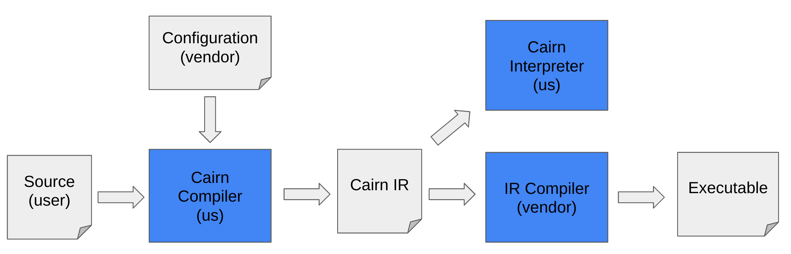
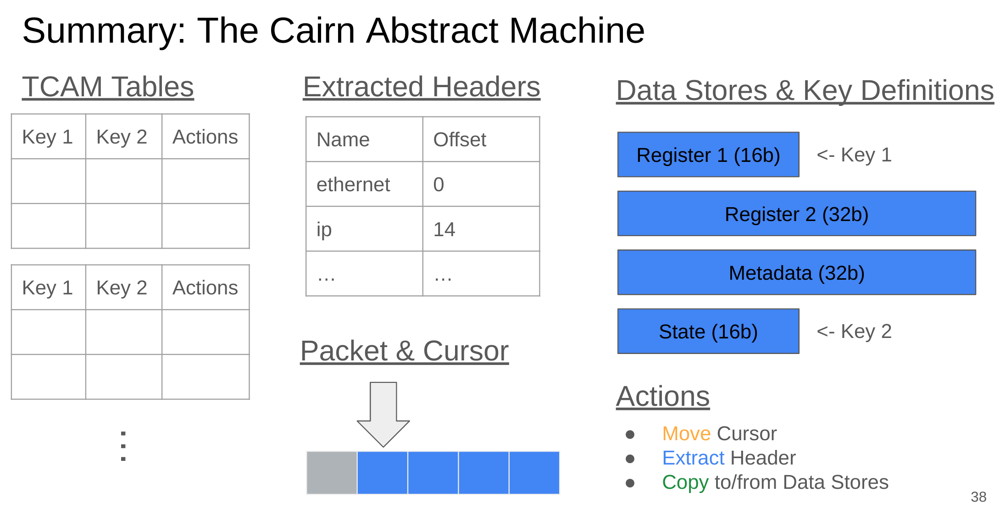

# The Cairn Model

This document contains the specification for the Cairn parser model. For a
high-level description of the motivation, model, and compilation process, one
can view
[this talk](https://drive.google.com/file/d/1Ih71ynJw_U_LGlQ2--rFnyOkU7pEtONh/edit)
to the P4 open-source developer meeting.

## Context

### Problem Statement

Programmable networking hardware (e.g. switches, SmartNICs, etc) is manufactured
by a variety of vendors, using proprietary designs. As a result, new
manufacturers face a huge burden: they need to not only develop a hardware
design from scratch, but also develop an *ecosystem* to support it – at minimum,
a compiler, to be able to actually run programs.

In practice, we find that even though each design has its own quirks and
restrictions, largely hardware tends to use similar high-level principles,
differing only in low-level implementation decisions. This is because the
various design teams tend to draw from similar sources in the literature –
particularly the TCAM packet parsing model proposed by Gibb et. al.
[here](http://yuba.stanford.edu/~nickm/papers/ancs48-gibb.pdf).

Despite the similarity between real designs, their proprietary nature means that
there is little opportunity to generalize across them. The goal of Cairn is to
create such an opportunity by providing an abstract *model* of a particular
hardware-friendly architecture, which can be used as the basis for designing and
implementing realistic parsers. In particular, this document will describe:

1.  A configurable, abstract model of packet parsing hardware based on TCAMs,
2.  A standardized way of configuring this model to represent different
    implementations in hardware (e.g. how many TCAMs are available, and how
    large they are), and
3.  A way of programming the model and compiling P4 parsers into a model program
    in a way that respects the constraints of the hardware.

### Benefits of Cairn

The Cairn model and compiler provide several benefits to the open-source
community. First, our model provides a common reference point for discussing the
design of packet parsers without revealing any proprietary implementation
details. It also provides a starting point for manufacturers creating new
hardware designs.

Second, hardware which implements the Cairn model can take advantage of our
open-source toolchain, including a P4-to-Cairn compiler and interpreter. Because
the Cairn model is closer to hardware than P4, the compiler must handle many of
the compilation challenges modern compilers face. By implementing these compiler
passes in the open-source, we allow manufacturers to use our compiler as a
frontend, massively reducing the work they have to do. Furthermore, because it
is open-source, the compiler can be improved over time by the community.

Finally, the Cairn compiler and interpreter allow P4 programmers to quickly test
if their program will work on a particular hardware configuration – even
configurations that do not exist, for exploratory purposes. By invoking the
Cairn compiler with a given configuration, users can get a very strong estimate
of whether or not their code will work on that hardware or not.

## Design

### Overview

The specification of Cairn has several parts:

1.  An specification of an abstract **model** describing a generic TCAM-based
    packet parser, including semantics for executing programs in that model.
2.  An **intermediate representation** (IR) for writing programs to be executed
    by the model.
3.  An **interpreter** which executes programs in the IR according to the
    semantics of the model.
4.  A **configuration language** for describing the implementation details of a
    particular piece of hardware.
5.  A **compiler** which takes a parser written in P4 along with a configuration
    file, and produces a program in the IR which conforms to the input
    configuration (or reports that doing so is not possible). This compiler
    should be integrated into p4c to re-use its infrastructure and make it easy
    for existing p4 users to use it.

The workflow from using Cairn is depicted below: the user writes a source
program, and passes it to the Cairn compiler along with the vendor-supplied
configuration file for the hardware they’re compiling to. The Cairn compiler
produces a Cairn program which is specialized to that hardware configuration.
This program can then either be interpreted (e.g. to quickly test its behavior),
or compiled further by a vendor-specific backend to produce a binary for the
hardware in question.



### Parser Model

Our parser model is inspired by
[Gibb et. al.](http://yuba.stanford.edu/~nickm/papers/ancs48-gibb.pdf); however,
it has been extended to represent important features of real parsers, most
notably by introducing the concept of a **Data Store**. Data stores are a
generalization of registers; each is a container for data that can be read
and/or written. Our design also introduces the concept of a **location**, which
is a range of bits inside some data store or the packet. Locations are written
as `src[start:end]`, where `src` is either the name of a data store or the
reserved string `packet`. Both `start` and `end` are inclusive.

Our model is an abstract machine which parses a single packet. All data in the
machine is specific to that packet; there is no global state that persists
between packets. We assume that the hardware is implemented as a series of
identical stages, each of which contains a TCAM table that is matched against
certain locations to determine the actions to perform in that stage.

Our model explicitly represents the keys that will be matched against the TCAM
in each stage. This is represented by designating certain locations inside data
stores to be "key locations"; in each stage, the values in these locations are
matched against that stage’s TCAM table. Hence, a program for this machine is
responsible for explicitly moving data to the appropriate location before
matching on it; in other words, there is no implicit operand fetching for TCAM
matches.

#### Syntax of the Model

Our model of TCAM parsers is as an abstract machine with the following
components:

1.  A buffered **packet**, represented as an array of bits.
2.  A **cursor** pointing to the earliest bit of the packet that has not yet
    been consumed.
3.  A string-indexed map for storing **extracted headers**.
4.  An integer representing the current **stage** of the parser.
5.  A **TCAM**, which is an ordered list of **tables**. Each table is an ordered
    list of **rules**, and each rule is a combination of a **pattern** and a set
    of **actions**.
    1.  A pattern is a list of integer values, each of which is associated with
        a same-width **mask**.
    2.  The possible actions are:
        1.  MoveCursor <n> - moves the packet cursor n bits
        2.  CopyValue <val> <loc> - copies a value to the location.
        3.  ExtractHeader <id> <loc> - Copies the data stored in loc to the map
            of extracted headers, using id as an index. The location must be
            within the packet.
6.  A set of **Data Stores**, each of which has several attributes:
    1.  A unique identifier
    2.  A width (in bits)
    3.  An annotation indicating if the store is read-only, write-only, or both
    4.  A flag indicating if the store’s value persists after parsing
    5.  A flag indicating if writes to a subset of the store (using a mask)
        preserve unwritten bits or set them to 0
7.  An ordered list of **key definitions** specifying the keys the TCAM matches
    against. Each key must be a location within a data store.

A visual representation of this model appears below.


##### Action Syntax

Definitions:

1.  An **Int Expression** (intexp) is either:
    1.  A constant integer,
    2.  A location expression,
    3.  A cast of an int expression to a particular bitwidth, or
    4.  A binary arithmetic operation (plus, left/right shift) between two int
        expressions.
2.  A **Location Expression** (locexp) has the form `src[start:end]`, where src
    is a string (either the name of a datastore, or the reserved string
    "packet"), and `start` and `end` are intexps. Some notes on semantics:
3.  All integer values are unsigned.
4.  If a location expression is evaluated as an integer expression (case (b)
    above), its value is the integer value of the bits at that location.
5.  Both the start and end index are inclusive. With those definitions in mind,
    the syntax of each action type is as follows:
6.  MoveCursor <int exp>
7.  CopyValue <int exp> <loc exp>
8.  ExtractHeader <string> <loc exp>

#### Semantics Overview

Rather than specifying a formal semantics, we give an overview of the high level
behavior. At a high level, the abstract machine above executes the following
algorithm: Get the table for the current stage, match it against the current
keys, execute the corresponding actions, and move to the next stage. This
process is described in more detail by the following pseudocode. In order to
focus on the core functionality, validation and error checking code is not
included.

Note that all reads from the packet are relative to the current cursor location.
Importantly, this means that bits in the packet prior to the cursor’s current
location are inaccessible. Note as well that each stage is "self-contained";
that is, all actions execute in exactly one (logical) clock cycle.

```
def apply_action(packet, state, action):
  if action is move(n):
    state.cursor += eval_intexp(n)
  if action is extract(id, loc):
    state.headers[id] = packet[loc.start + state.cursor : loc.end + state.cursor]
  if action is copy(v, loc):
    data = eval_intexp(v)
    state.stores[loc.name][loc.start : loc.end] = data

def parse(packet, state, program):
  state.cursor = 0
  state.stage = 0
  state.tables = parse_ir(program)

  while(state.stage < len(state.tables)):
    table = state.tables[state.stage]
    keys = [ state.stores[loc.name][loc.start : loc.end] for loc in keys ]
    actions = tcam_match(table, keys)
    apply_actions_simultaneous(packet, state, action)
    state.stage += 1
```

#### Restrictions of the Model

In order to ensure execution of the model "makes sense", we impose the following
restrictions:

1.  No set of actions may contain overlapping writes
    1.  Rationale: Per the above semantics, there is no particular order in
        which actions in a given stage are executed. Hence the result of writing
        to the same location multiple times in a stage is undefined, and should
        be avoided.
1.  Every rule in the TCAM must use the same pattern structure (number of
    patterns and their sizes), which must correspond to the key definitions in
    the model.
    1.  Rationale: In hardware, the number and sizes of TCAM keys are fixed.
        Although the model does not specify what those values are, all parts of
        the program should be consistent.

#### Implications of the Model

By design, our model contains several assumptions about the hardware it
represents. In particular, we assume that:

1.  The TCAM is implemented as a series of individual tables, which are each
    executed exactly once, in order.
    1.  We could probably accommodate the other common setup, having one big
        TCAM table that is iteratively executed, by tweaking the model slightly.
2.  Each stage of the TCAM is atomic (i.e. all parts of each stage happen in
    exactly 1 logical clock cycle).
3.  No part of the packet before the cursor’s current location can be accessed.
4.  All stages of the parser are identical (i.e. they have exactly the same
    capabilities).
5.  All parse graphs are DAGs.
6.  The parser parses exactly one packet at a time (logically speaking), with no
    dependence between parsed packets.
7.  All integers are unsigned.

### Example: Simple P4 Parser

#### P4 Parsers

This section provides an example of how the above model could be used to
represent a parser written in P4. P4 parsers are state machines, in which each
state reads some data from the packet, examines it, and transitions to the next
state. There are two special states, accept and reject, in which parsing always
terminates. The following code snippet shows a basic P4 parser:

```
state start {
  p.extract (hdr.ethernet); // 14 bytes
  transition select (hdr.ethernet.etherty) { // 16 bits
    0x0800 : parse_ipv4
    0x86DD : parse_ipv6
  }
}

state ipv4 {
  p.extract (hdr.ipv4); // 20 bytes
  transition select (hdr.ipv4.srcaddr) { // 32 bits
    127.0.0.* : reject
    default : accept
  }
}

state ipv6 {
  p.extract (hdr.ipv6); // 40 bytes
  transition accept;
}
```

#### Graph Representation

P4 parsers can be represented as a directed acyclic graph (DAG), in which each
node executes some actions and sets one or more keys. Edges in the graph are
annotated with patterns; an edge is taken if its patterns match the value of the
keys set by its source node. All edges leaving a particular node are ordered,
and if multiple edges match, only the first edge in the order is taken.

In graph form, P4 parsers utilize the following actions:

1.  Extract id n: extracts an `n`-bit header from the cursor’s current location,
    then moves immediately after that header. In P4, `n` is often specified as
    the size of a type. Equivalent to `ExtractHeader id
    packet[cursor:cursor+n-1]; Move n;`
2.  Lookahead x n: Reads the next `n` bits of the packet and stores it in the
    local variable x. Unlike extract, this does not then move the cursor.
3.  Skip ty: Moves the cursor forward `sizeof(ty)` bits
4.  SetKey var1 var2 …: Sets the keys to be matched upon in this stage to the
    current value of `var1, var2,` etc.

The simple parser above corresponds to the following DAG. We have translated the
P4 into pseudocode actions, and assigned each state an integer identifier. Each
edge is annotated with the corresponding pattern, as well as a priority value
preceding it. Default edges are considered to always have the lowest priority.
We have assigned each state in the graph an integer identifier, as follows:
start = 1 , ipv4 = 2, ipv6 = 3, accept = 99, reject = 100.


#### Representation as a TCAM

To see how we can translate this DAG to our TCAM model, assume we have two
registers, "state" and "r1", which are used as keys and are both 32 bits wide.
We will convert each edge in the graph to a TCAM rule, which matches on that
edge’s source and pattern, and executes the actions of its destination.

Since the start state has no incoming edges, its rule is special: we use the
wildcard pattern _ to ignore the value of both "state" and "r1", because we
always execute the start state’s actions. Those actions extract the ethernet
header, store the ethertype field (the 96th-112th bits) in r1, and set the state
to the constant 1. Finally, it moves past the ethernet header.

“state” | “r1” | Actions
------- | ---- | ------------------------------------------
_       | _    | ExtractHeader “hdr.ethernet” packet[0:111]
        |      | CopyData packet[96:111] r1[0:15]
        |      | CopyData 1 state[0:31]
        |      | Move 112

The next stage performs ethertype match (against r1), and determines which state
to transition to. Transitioning to a state is represented by performing that
state’s actions, as well as copying its ID into the “state” register. In the
below table, the first rule transitions to the “ipv4” state and the second rule
to the “ipv6” state. Note that while both rules update the state register, only
the first rule updates r1, since only the ipv4 state performs a match when
exiting the node.

“state”   | “r1”   | Actions
--------- | ------ | --------------------------------------
1 (start) | 0x0800 | ExtractHeader “hdr.ipv4” packet[0:159]
          |        | CopyData packet[96:127] r1[0:31]
          |        | CopyData 2 state[0:31]
          |        | Move 160
1 (start) | 0x86DD | ExtractHeader “hdr.ipv6” packet[0:319]
          |        | CopyData 3 state[0:31]
          |        | Move 320

Finally, we transition to either the accept (99) or reject (100) state as
appropriate. Note that we only use the value of “r1” if the previous state was
ipv4, which we determine by matching against the previously-set state ID. As an
optimization, we might be able to combine the last two rules, since they execute
the same set of actions.

“state”  | “r1”      | Actions
-------- | --------- | ------------------------
2 (ipv4) | 127.0.0.* | CopyData 100 state[0:31]
2 (ipv4) | _         | CopyData 99 state[0:31]
3 (ipv6) | _         | CopyData 99 state[0:31]

### Configuring the Model

Our model describes the high-level behavior of most modern packet-parsing
hardware. However, it deliberately omits many details, such as the number of
TCAM tables and size of the keys for each. This information is supplied via
configuration files describing each piece of hardware, written in our
configuration language.

The following parameters of the model may be configured:

1.  The maximum number of stages in the parser (int)
2.  The maximum number of rules per stage (int)
3.  The set of data stores that exist in the parser (list of definitions
    specifying each attribute of each datastore, as described in the model
    definition)
4.  Which locations (in data stores) are used as keys to be matched against by
    the TCAM (ordered list of locations)
5.  The ID numbers of the `accept` and `reject` states (ints)

In the future, we will likely wish to add additional parameters. These are
described in the Future Work section below.

Our configuration language is structured as a json, using the following syntax:

```
{
  "max-stages" : 32,
  "max-rules-per-stage" : 16,
  "data stores" : [
     { "name" : "r1", "width": 32, "read": true, "write": true,
       "persistent": false, "masked-writes": false },

     { "name" : "r2", "width": 16, "read": true, "write": true,
       "persistent": false, "masked-writes": false },

     { "name" : "metadata", "width": 64, "read": true, "write": false,
       "persistent": false, "masked-writes": false },

     { "name" : "state", "width": 64, "read": false, "write": true,
       "persistent": true, "masked-writes": false },

     { "name" : "flags", "width": 8, "read": true, "write": true,
       "persistent": true, "masked-writes": true }

  ],
  "keys" : [ "r1[0:31]", "state[0:31]" ],
  "accept_id" : 99
  "reject_id" : 100
}
```

The most important part of the file is the definition of the data stores. This
example defines 5 data stores:

1.  Two stores, "r1" and "r2", which are respectively 32 and 16 bits wide, and
    can be both read and written. If a subset of their bits is written, the
    remaining bits are zeroed out, and the values in these stores are not
    accessible after parsing completes.
2.  A read-only "metadata" store, whose only use is to be read into "r1" and
    "r2".
3.  A write-only "state" store, whose only use is to be matched against as a
    TCAM key. The value of the state store also persists past the end of the
    parser, so the packet processing pipeline can see what the final state was.
4.  A read/write "flags" store which persists beyond the parser, and which
    supports writing a subset of its bits without affecting the other bits.

The file also tells us other important information about the hardware:

1.  Its TCAM matches on two keys: 16 bits drawn from "r1", and the first 32 bits
    of "state"
2.  The TCAM has 32 stages, each of which may have at most 16 rules

### Intermediate Representation

Together, the model and configuration file specify the architecture of a piece
of hardware. This hardware is programmed by setting the values in the TCAM:
specifically, what the rules are for each table. This information is provided by
programs written in our IR.

A program in the IR defines a list of TCAM tables. Each table is a list of
rules, each of which consists of one pattern for each key, as well as a set of
actions. IR files are written in json. For example, consider the following
table, where we use * to indicate "don’t care" bits (those that are masked out)

Key 0  | Key 1  | Actions
------ | ------ | -------------------------------
0b1**0 | 0b0000 | CopyData packet[0:3] state[0:3]
       |        | Move 32
0b00** | 0b110* | Extract "hdr" packet[0:15]
       |        | CopyData packet[4:7] state[0:3]
       |        | Move 16

We represent this table in json as follows.

```
[
  { "table" : 0,
    "rule" : 0,
    "patterns": [  "0b1**0", "0b0000" ],
    "actions": [
      { "type": "CopyData", "src" : "packet[0:3]", "dst" : "state[0:3]" },
      { "type": "MoveCursor", "numbits" : "32" }
   ] },

  { "table" : 0,
    "rule" : 1,
    "patterns": [  "0b00**", "0b110*" ],
    "actions": [
      { "type": "ExtractHeader", "id" : "hdr", "loc" : "packet[0:15]" },
      { "type": "CopyData", "src" : "packet[4:7]", "dst" : "state[0:3]" },
      { "type": "MoveCursor", "numbits" : "16" }
   ] }
]
```

ASIDE: instead of representing patterns as strings, we could instead represent
them as pairs of integers. In this form each pattern is represented as a value
followed by a mask; bits where the mask is 1 must be matched exactly, whereas
bits where the mask is 0 need not be matched. For example, the pattern `0b1**0`
represents 4-bit integers which begin with a 1 and end with a 0. We represent
this pattern in json as `("1110", "1001")`; the first entry is the value, and
the second is the mask. The middle two bits of the value are irrelevant, since
they are masked out; for consistency, we fill in all such bits with 1.

#### Specification

An IR program is a JSON file whose top level object is a list of tables.

1.  Each table is a list of rules.
2.  Each rule is a JSON object with the following fields: "patterns", "actions",
    “table” and “rule”.
3.  Each “table” and “rule” field is an integer, containing the index of the
    rule’s table and the index of the rule within the table.
4.  Each "patterns" field is a list of patterns.
5.  Each pattern is a string representation of an integer in either binary or
    hexadecimal, with any number of digits replaced by "*". Binary strings must
    start with "0b", and hex strings must start with "0x".
6.  Each action is a json object with a "type" field, which must be one of
    "MoveCursor", "CopyData" or "ExtractHeader". The other fields of the object
    vary based on its type:
    1.  "MoveCursor" objects must have a field named "numbits", an integer
        expression (note: integer expressions are not json integers).
    2.  "CopyData" objects must have a field named "src", which is an integer
        expression, and a field named "dst", which is a location expression.
    3.  "ExtractHeader" objects must have a field named "id", which is a string,
        and a field named "loc", which is a location expression.
7.  An integer expression is a string with one of the following forms:
    1.  An integer with a bitwidth, e.g. "5w16" represents a 16-bit integer with
        value 5.
        1.  Syntactic sugar: If no width is specified, a width of 32-bits is
            inferred.
    2.  A location expression
    3.  Two integer expressions separated by an arithmetic operation, which may
        be either "+", "<<", ">>", or “-”.
    4.  Parentheses may be used to enforce precedence
8.  A location expression is a string of the following form: "name[start:end]".
    The name may be an arbitrary string; start and end must be integer
    expressions.

#### Well-formedness

We impose the following additional restrictions on IR files:

1.  Each "patterns" field must have the same shape – i.e. the same number of
    patterns, and the same size patterns in the same order.
2.  The "loc" field of "ExtractHeader" actions must always refer to a location
    within the packet.
3.  The “table” and “rule” fields of each rule must correspond to their position
    within the program (i.e. all rules in the first table must have index 0, and
    their indices should increase from 0 to n in steps of 1).

### Interpreter

To test and debug IR files, we have implemented an interpreter for Cairn IR
programs. The interpreter implements the specifications above, taking a
configuration file and an IR program as inputs, and will execute the IR program
according to the above semantics. Note that the only information we need from
the configuration file is the definition of the data stores and the keys; all
other constraints should be enforced by the compiler which produced the IR
(described below), or manually (if a human wrote the IR for testing purposes).

Our interpreter is written in Python, and consists of the following major
components:

1.  A definition of the abstract syntax of the interpreter (i.e. the datatypes
    that are manipulated). In particular, this includes a definition of the
    abstract machine described above.
2.  Functions for manipulating these datatypes. The primary function is the one
    that actually interprets the program, which is implemented as a function
    which takes a TCAM (the IR program), a packet, and a machine state, and
    produces a new machine state.
3.  Parsers for both configuration files and IR programs.
4.  Unit tests for each of the above components, as well as several end-to-end
    tests involving the example IR program above.

The interpreter allows users to test the behavior of the IR program without
actually compiling it to hardware. This can be useful for debugging, or for
validating a compiler’s implementation. It is also useful for debugging and
validating the specification itself, and for explaining the model by example,
rather than abstractly (as we do in this document).

### Compiling from P4

The design of our compiler is detailed in the “compiler_design.md” document.

## Alternative Designs

This section describes alternatives which we discussed or considered in the
past, but ultimately rejected.

### User Workflow

Our proposed workflow requires users to supply a configuration file to our
compiler along with their source code; we then compile their code according to
that configuration. This allows us to answer the question "does this hardware
support this P4 program"? However, we only answer that question by *actually
performing* the bulk of the compilation process, which might end up being
lengthy. Furthermore, it requires users to perform one compilation for each
potential hardware target. One could imagine an alternative design in which,
given a P4 program, we attempt to infer what constraints on the hardware would
allow it to be compiled; in theory, we could then compare those constraints
(which are generated once) to a given hardware’s configuration file to see if
the hardware could support the P4 program. However, there are a lot of different
ways that a piece of hardware could support a given program. If the program only
uses 16-bit keys, it’s natural to expect the hardware should support 16-bit keys
as well; however, it’s also possible to compile the program to a hardware which
uses 8-bit keys, at the cost of using additional stages. In general, a
description of the constraints for a particular program would not be a simple
specification ("this program requires at least X stages"), but some complicated
formula (e.g. "the product of the number of stages and the key size must be X").
Determining what formulae are appropriate is likely to be extremely challenging,
and more so actually inferring them automatically.

### Data Stores and Attributes

In earlier versions of this project, we modeled several different pieces of the
parser separately, e.g. registers for storing keys, registers for storing
states, registers for storing "generic data", metadata fields, flags. This
approach had the advantages that we knew precisely what purpose each of these
pieces served, and could customize their usage appropriately (e.g. we knew that
certain types of metadata were inherently read-only). However, this approach was
not very general; while hardware could opt not to use some of these pieces, we
didn’t have any way for it to specify its own custom elements. In the current
version, we have eliminated these distinctions, unifying them into the single
concept of a Data Store, each of which has several attributes (read/write,
persists after parsing, etc.). Doing so allows us to treat all the elements
using the same framework, and allows different architectures to easily declare
their own novel elements. However, the number of attributes per Data Store is
currently quite limited, meaning that certain hardware details cannot be
represented. We could increase expressivity in the future by increasing the
types of attributes stores can have; however, each new attribute increases the
complexity of the model, especially if an attribute is added for a specific
purpose, and is almost always unused outside of that niche.

### Constraints vs. Attributes

Earlier versions of this project viewed many hardware constraints as being
something that primarily applied to actions (e.g. "you can only do 2 extracts
per stage"). While some such constraints remain, we have found that much of the
complexity is better expressed as attributes of Data Stores. For example, rather
than saying "You can’t have any copy commands writing into Store A", we just set
a read-only flag. There are also several additional constraints we may wish to
add in the future, for example restricting which locations can write to each
other. Naively, we could do so by adding a bunch of constraints along the lines
of "You can’t write from A into B"; however, instead we can include a list of
acceptable sources for each store. By conceptualizing constraints as attributes
of stores rather than their own json entries, we both simplify the language
(keeping lists of "real" constraints small) and provide a large amount of
flexibility when declaring an architecture, since attributes of each store can
be customized separately.

### Expanding Data Stores

The TCAM model described above abstracts away much of the parser’s memory and
resources as Data Stores. However, certain parts of the model are left separate.
One could imagine broadening the definition of Data Stores further; for example,
by implementing the packet as a read-only data store, the cursor as a read/write
store, and the stack of extracted headers as a write-only store. This has the
appeal of simplifying the core of the model by unifying almost everything under
the umbrella of “Data Store”. However, each of these pieces is sufficiently
special that attempting to generalize them would require carving out exceptions
for them, likely undoing any gains in simplicity. In particular, each piece has
its own special properties:

1.  The **packet** has an unknown length, unlike regular Data Stores which have
    fixed length. Furthermore, all reads from the packet are measured from the
    position of the cursor, rather than the beginning of the store. Finally, if
    the packet were represented as a store, it would have to be a
    designated-special store anyway, since we need to know where to extract
    headers from.
2.  The **cursor** could be modeled as a special data store which is incremented
    by the Move command. However, its value is treated specially; it is
    automatically added to packet accesses, and cannot otherwise be read or
    modified by the program.
3.  The **header stack** typically does not store the actual value of extracted
    headers, but instead just stores an offset into the packet indicating where
    that header resides. Hence the Copy command is not suited for extracting
    headers, so we need a special command for that purpose. Furthermore, the
    stack is more structured than data stores: it consists of a list of (id,
    offset) tuples, rather than just a single value. One would also need to
    ensure that writes to the header stack never overwrite previously-written
    values, which requires a way of determining how much of the stack has been
    written so far (e.g. something like the packet cursor, but for the header
    stack).

### Location Syntax & Byte Ordering

Currently, the syntax for location expressions is as follows: “name[start:end]”,
where `name` is a string and `start` and `end` are integer expressions. Such an
expression designates the range of bits from index `start` to index `end`,
inclusive, within the data store `name` (or the packet). Previous versions of
the design had `start` inclusive and `end` exclusive, but this was changed for
better consistency with the rest of the field (in particular, P4 slicing
syntax). In the current model, bits are numbered with 0 on the left, increasing
as we go to the right; hence `start` must always be less than or equal to `end`.
For example, `store[0:7]` refers to the left-most 8 bits of the store `store`.

#### Bit Indexing

One alternative discussed was to order bits in the opposite direction, so that
larger indices are on the left. Thus one would write `store[7:0]` to refer to
the right-most 8 bits of `store`. The advantage of this approach is that it is
even closer to the rest of the field; in particular, this is the syntax P4 uses
for bit-slicing. Unfortunately, the inclusion of the packet and cursor in our
model make this approach more complicated. While we can easily number the bits
of data stores starting at the right, the packet has unknown length; hence the
only sensible way of numbering its bits is to start at the left (where the
cursor is). We discussed three possible options to try to address this issue,
which are detailed below. Ultimately, we chose to make no changes, in large part
due to time constraints. If we later decide to implement one of these changes,
the second is the most consistent, as it not only solves the problem at hand but
resolves some existing corner cases as well, and does not introduce any new
sources of confusion or inconsistency.

#### Option 1

The first option we discussed was to have two different bit orders: locations
within the packet would continue having `start <= end`, while locations within
stores would use the opposite order. However, this introduces
potentially-confusing inconsistencies in our syntax, as well as removing a handy
invariant on location expressions.

#### Option 2

The second option was to number bits from the right, and remove packet locations
entirely. Doing so would involve modifying the syntax of `ExtractHeader` to take
two offsets instead of a location, and creating an entirely new command for
copying data out of the packet (e.g. `CopyFromPacket offset1 offset2 loc`). The
downside here is that it increases the size of the IR, as we now have 4
commands, 2 of which (`CopyData` and `CopyFromPacket` are extremely similar).
However, it has the upside of removing some corner cases regarding packet
locations, e.g. the requirement that every `ExtractHeader` location be in the
packet (which requires a separate check).

#### Option 3

The final option we considered was to make all the changes in option 2, but to
additionally introduce a notion of bytes and endianness. Extracting from the
packet automatically converts from network byte order (big-endian) to host order
(little-endian). Hence if the next 16 bits of the packet contained `0x8001`,
then the command `CopyFromPacket 0 15 store[15:0]` would store the byte `80` in
the last 8 bits of `store` (`store[7:0]`) and the byte `01` in the next 8 bits
(`store[15:8]`). The advantage of this approach is that it most closely matches
the behavior of actual hardware. This means that our compiler will take care of
endianness problems, and the vendor’s backend compiler won’t have to. In
addition, it may be easier to debug backend compilers, since the byte order in
the IR will match the order on the actual hardware. However, this approach also
has significant disadvantages: it requires introducing a notion of bytes into
the model, which currently only deals with individual bits. It also requires
users to reason manually about whether or not bytes have been swapped at any
given point when writing or debugging an IR program. Furthermore, it makes
assumptions about what the hardware will do regarding byte order, and increases
the complexity of our compiler. While reducing the burden on backend compilers
is useful, dealing with endianness issues is already a pervasive problem, so the
benefit to the vendor may not be worth the additional work on our part.

## Future Work

This section details future extensions to the model which we expect to
implement, either to increase its expressivity or fidelity.

### Additional Data Store Attributes

We have considered several additional attributes that data stores might have.
Ultimately, many of these were removed in order to keep the core model simple;
however, they may prove useful in the future to increase our ability to model
different hardware. Adding new attributes requires updating the model, the
interpreter, and the compiler to account for them.

Possible attributes that we did not include are:

1.  For each data store, a list of other stores which can write to it.
    1.  We currently assume that everything can write to everything else, but
        this could be used to provide finer-grained control.
2.  The maximum number of reads/writes which can involve each store in each
    stage.
    1.  We currently allow arbitrary numbers of writes per stage, but this could
        be used to set a particular limit (e.g. one write per stage).
3.  The minimum number of writes to each store in each stage.
    1.  A minimum number of writes could be used to indicate registers which are
        always written every stage (and hence are unsuitable for long-term data
        storage).
4.  For each store, an "acceptable write range" indicating how many bits can be
    written at once; for example, only allowing writes in increments of 8 bits.
    1.  This could be used to model similar hardware restrictions, if hardware
        only supports byte-sized writes. It could also be used for stores meant
        to represent flags, by allowing single bits to be set in that store
        only.

### Additional Configuration Options

Our current configuration language only supports six different entry types; in
the future, we will likely want the ability to describe additional kinds of
constraints. Some of these include:

1.  The maximum number of bits from the cursor that can be read during a Copy
    command (int)
2.  The maximum number of bits from the cursor that can be read during an
    Extract command (int)
3.  The maximum number of times each action can appear in a given action set
    (int)
4.  The maximum number of total actions which can appear in a given action set
    (int)
5.  Any sets of actions which are not allowed to appear together (e.g. two
    Copies and two Extracts)
6.  The maximum number of extracted headers (int).
    1.  We may also want to move away from modeling this as a string-indexed map
        to something closer to hardware, e.g. a stack.

### ALUs and Arithmetic

Arithmetic operations are necessary to handle variable-sized packet headers. In
our current model, we allow arbitrary arithmetic within actions, e.g. `Move
(n+len)`. We made this choice for simplicity and ease of implementation. In
reality, each arithmetic operation must be executed by an ALU or some
specialized piece of hardware. Accordingly, the number of ALUs is an important
factor when compiling parsers to the hardware, along with the operations each
ALU supports. One possible way of representing this is as follows:

1.  In the configuration language, define the number of ALUs available in each
    stage, along with the set of operations each ALU can execute.
2.  For each arithmetic expression in the program, determine which ALUs can
    execute it.
3.  During compilation, assign each operation to an appropriate ALU. If there
    are too many expressions in a single stage, assign as many as possible, and
    shunt the remainder to the next stage. This is a relatively simple way of
    expressing the fundamental constraint; however, it does not capture all the
    available hardware capabilities, because it is common for hardware to be
    able to execute certain simple operations for "free" without requiring an
    ALU. Finding ways to represent this sort of "extra" computational power
    requires more research.

#### ALU “keys”

In addition to the above strategy, we might also decide to designate certain
locations as the inputs for each ALU, the same way we designate certain
locations to be the source of the keys that the TCAM matches against. This would
require our IR programs to explicitly move data to the appropriate ALU inputs,
but would reduce the burden of backend compilers to do the same. Since we
already do this for TCAM keys, the additional burden for us is likely to be
minimal.
